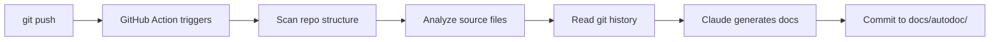

# 📖 VibeDoc

**Your project documents itself every time you push.**

Push code → docs appear automatically. Zero config. Zero effort.

AutoDoc is a GitHub Action that uses AI to scan your codebase and generate complete documentation on every push: architecture overview, API docs, onboarding guide, and decision log.

---

## Quick Start (2 minutes)

### Step 1: Add your API key

Go to your repo → **Settings** → **Secrets and variables** → **Actions** → **New repository secret**

| Name | Value |
|------|-------|
| `ANTHROPIC_API_KEY` | Your Anthropic API key |

### Step 2: Add the workflow file

Create `.github/workflows/autodoc.yml` in your repo:

```yaml
name: AutoDoc
on:
  push:
    branches: [main]
    paths-ignore:
      - "docs/autodoc/**"

permissions:
  contents: write

jobs:
  generate-docs:
    runs-on: ubuntu-latest
    steps:
      - uses: actions/checkout@v4
        with:
          fetch-depth: 50
      - uses: kiara-inc/autodoc-action@v1
        with:
          anthropic_api_key: ${{ secrets.ANTHROPIC_API_KEY }}
```

### Step 3: Push

```bash
git add .github/workflows/autodoc.yml
git commit -m "Add AutoDoc"
git push
```

Done. Your `docs/autodoc/` folder will appear with:

| File | What it does |
|------|-------------|
| `ARCHITECTURE.md` | System design, tech stack, data flow diagrams |
| `API.md` | Every endpoint/function with examples |
| `ONBOARDING.md` | Clone-to-running guide for new developers |
| `DECISIONS.md` | Why things were built this way (from git history) |

---

## Configuration

All settings are optional. Defaults work for most projects.

```yaml
- uses: kiara-inc/autodoc-action@v1
  with:
    anthropic_api_key: ${{ secrets.ANTHROPIC_API_KEY }}

    # Output directory (default: docs/autodoc)
    output_dir: "docs/autodoc"

    # Language: "en", "ja", or "both" (default: en)
    language: "both"

    # Toggle individual docs on/off
    include_api_docs: "true"
    include_architecture: "true"
    include_onboarding: "true"
    include_decisions: "true"

    # Cost control: max source files to analyze (default: 50)
    max_files: "50"

    # File types to analyze (default: common languages)
    file_extensions: ".py,.ts,.tsx,.js,.jsx,.go,.rs,.java,.rb,.php"
```

---

## How It Works



1. You push code to `main`
2. AutoDoc scans your repo: source files, configs, directory structure, git log
3. Claude analyzes everything and generates 4 documentation files
4. Docs are committed back to your repo automatically
5. Loop prevention: doc-only commits don't re-trigger the action

---

## Cost Estimate

AutoDoc makes 1 API call per document (4 total per run). Typical cost:

| Repo Size | Files Analyzed | Estimated Cost |
|-----------|---------------|----------------|
| Small (< 20 files) | ~15 | ~$0.10 |
| Medium (20-50 files) | ~40 | ~$0.25 |
| Large (50+ files) | 50 (capped) | ~$0.35 |

Runs only on push to `main`, so daily cost is minimal for most teams.

---

## Examples

See the [`examples/`](./examples/) directory for ready-to-use workflow files.

---

## FAQ

**Q: Will this create an infinite loop of commits?**
No. The workflow uses `paths-ignore` to skip triggers when only `docs/autodoc/` changes.

**Q: Is my code sent to an external API?**
Yes, source file contents are sent to the Anthropic API for analysis. Review their [privacy policy](https://www.anthropic.com/privacy). The API does not train on your data.

**Q: Can I use this with private repos?**
Yes. Your code is only sent to the Anthropic API, not stored elsewhere.

**Q: What if my repo is huge?**
The `max_files` setting (default: 50) caps how many files are analyzed. Large files are truncated at 50KB.

---

## License

MIT License - Copyright (c) 2026 Kiara Inc.

---

# 📖 AutoDoc（日本語版）

**プッシュするだけで、プロジェクトが自動的にドキュメント化されます。**

設定不要。手間ゼロ。コードをプッシュすれば、ドキュメントが自動生成されます。

---

## クイックスタート（2分）

### ステップ1：APIキーを追加

リポジトリの **Settings** → **Secrets and variables** → **Actions** → **New repository secret**

| 名前 | 値 |
|------|-------|
| `ANTHROPIC_API_KEY` | Anthropic APIキー |

### ステップ2：ワークフローファイルを追加

`.github/workflows/autodoc.yml` を作成：

```yaml
name: AutoDoc
on:
  push:
    branches: [main]
    paths-ignore:
      - "docs/autodoc/**"

permissions:
  contents: write

jobs:
  generate-docs:
    runs-on: ubuntu-latest
    steps:
      - uses: actions/checkout@v4
        with:
          fetch-depth: 50
      - uses: kiara-inc/autodoc-action@v1
        with:
          anthropic_api_key: ${{ secrets.ANTHROPIC_API_KEY }}
          language: "ja"  # 日本語ドキュメント
```

### ステップ3：プッシュ

```bash
git add .github/workflows/autodoc.yml
git commit -m "Add AutoDoc"
git push
```

完了。`docs/autodoc/` フォルダに以下が自動生成されます：

| ファイル | 内容 |
|---------|------|
| `ARCHITECTURE.md` | システム設計、技術スタック、データフロー図 |
| `API.md` | 全エンドポイント・関数のドキュメント（サンプル付き） |
| `ONBOARDING.md` | 新メンバー向けセットアップガイド |
| `DECISIONS.md` | なぜそう作ったか（git履歴から推論） |

---

## 設定オプション

すべてオプション。デフォルトで動作します。

| パラメータ | デフォルト | 説明 |
|-----------|----------|------|
| `output_dir` | `docs/autodoc` | ドキュメント出力先 |
| `language` | `en` | `en`（英語）、`ja`（日本語）、`both`（両方） |
| `include_api_docs` | `true` | API ドキュメント生成 |
| `include_architecture` | `true` | アーキテクチャ概要生成 |
| `include_onboarding` | `true` | オンボーディングガイド生成 |
| `include_decisions` | `true` | 意思決定ログ生成 |
| `max_files` | `50` | 解析する最大ファイル数 |

---

## ライセンス

MIT License - Copyright (c) 2026 Kiara Inc.
