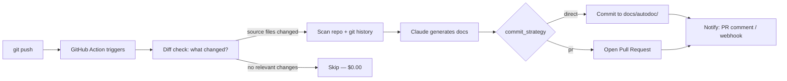

# 📖 VibeDoc

[](https://github.com/kiara-inc/autodoc-action)
[](LICENSE)

**Your project documents itself every time you push.**

Push code → docs appear automatically. Zero config. Zero effort.

AutoDoc is a GitHub Action that uses AI to scan your codebase and generate complete documentation on every push: architecture overview, API docs, onboarding guide, decision log, and changelog.

---

## Quick Start (2 minutes)

### Step 1: Add your API key

Go to your repo → **Settings** → **Secrets and variables** → **Actions** → **New repository secret**

| Name | Value |
|------|-------|
| `ANTHROPIC_API_KEY` | Your Anthropic API key |

### Step 2: Add the workflow file

Create `.github/workflows/autodoc.yml` in your repo:

```yaml
name: AutoDoc
on:
  push:
    branches: [main]
    paths-ignore:
      - "docs/autodoc/**"

permissions:
  contents: write

jobs:
  generate-docs:
    runs-on: ubuntu-latest
    steps:
      - uses: actions/checkout@v4
        with:
          fetch-depth: 50
      - uses: kiara-inc/autodoc-action@v1
        with:
          anthropic_api_key: ${{ secrets.ANTHROPIC_API_KEY }}
```

### Step 3: Push

```bash
git add .github/workflows/autodoc.yml
git commit -m "Add AutoDoc"
git push
```

Done. Your `docs/autodoc/` folder will appear with:

| File | What it does |
|------|-------------|
| `ARCHITECTURE.md` | System design, tech stack, data flow diagrams |
| `API.md` | Every endpoint/function with examples |
| `ONBOARDING.md` | Clone-to-running guide for new developers |
| `DECISIONS.md` | Why things were built this way (from git history) |
| `CHANGELOG.md` | Auto-generated from conventional commits |

---

## Configuration

All settings are optional. Defaults work for most projects.

```yaml
- uses: kiara-inc/autodoc-action@v1
  with:
    anthropic_api_key: ${{ secrets.ANTHROPIC_API_KEY }}

    # Output directory (default: docs/autodoc)
    output_dir: "docs/autodoc"

    # Language: "en", "ja", or "both" (default: en)
    language: "en"

    # Toggle individual docs on/off (all default: true)
    include_architecture: "true"
    include_api_docs: "true"
    include_onboarding: "true"
    include_decisions: "true"
    include_changelog: "true"

    # Diff mode: skip docs with no relevant file changes (default: true)
    # Keeps most runs under $0.05
    diff_mode: "true"

    # Cost control: max source files to analyze (default: 50)
    max_files: "50"

    # File types to analyze (default: common languages)
    file_extensions: ".py,.ts,.tsx,.js,.jsx,.go,.rs,.java,.rb,.php"

    # Commit strategy: "direct" commits to current branch (default)
    # Use "pr" to have AutoDoc open a pull request instead
    commit_strategy: "direct"

    # Slack or Discord webhook URL for notifications (optional)
    webhook_url: ${{ secrets.SLACK_WEBHOOK_URL }}

    # GitHub token — defaults to github.token, override if needed
    # github_token: ${{ secrets.GITHUB_TOKEN }}
```

---

## How It Works



1. You push code to `main`
2. AutoDoc checks what changed (`git diff HEAD~1`) — skips unchanged doc types entirely
3. Scans your repo: source files, configs, directory structure, git log
4. Claude generates up to 5 docs: ARCHITECTURE, API, ONBOARDING, DECISIONS, CHANGELOG
5. Docs are committed directly or via a pull request (your choice)
6. PR comment + webhook notification sent if configured
7. Loop prevention: doc-only commits don't re-trigger the action

---

## Features

### Diff Mode (default: on)
AutoDoc tracks which files changed since the last commit and only regenerates the docs that are affected. A CSS-only push won't re-run ARCHITECTURE or API. This keeps typical runs under $0.05.

### PR Comment Bot
When the action runs on a `pull_request` event, AutoDoc posts a comment listing which docs were updated or skipped. Add `pull_request` to your workflow triggers to enable this:

```yaml
on:
  push:
    branches: [main]
    paths-ignore:
      - "docs/autodoc/**"
  pull_request:
    branches: [main]
```

### CHANGELOG.md
AutoDoc parses your git history for conventional commits (`feat:`, `fix:`, `refactor:`, etc.) and generates a [Keep a Changelog](https://keepachangelog.com)-formatted `CHANGELOG.md` on every run.

### Slack / Discord Notifications
Add a webhook secret and AutoDoc will ping your channel whenever docs are updated:

```yaml
webhook_url: ${{ secrets.SLACK_WEBHOOK_URL }}
```

Works with Slack incoming webhooks and Discord webhook URLs.

### PR Strategy
Prefer not to have a bot commit directly to `main`? Use `commit_strategy: "pr"` and AutoDoc will open a pull request instead:

```yaml
commit_strategy: "pr"
```

### GitLab CI
See [`examples/gitlab-ci.yml`](./examples/gitlab-ci.yml) for a drop-in GitLab CI equivalent.

---

## Cost Estimate

AutoDoc makes 1 API call per document (up to 5 per run). With diff mode on (default), most pushes only regenerate 1-2 docs.

| Scenario | Docs Generated | Estimated Cost |
|----------|---------------|----------------|
| Full run, small repo | 5 | ~$0.15 |
| Full run, large repo | 5 (50 files capped) | ~$0.40 |
| Diff mode, source change | 2-3 | ~$0.05 |
| Diff mode, docs/config only | 0 | $0.00 |

Runs only on push to `main`, so daily cost is minimal for most teams.

---

## Examples

See the [`examples/`](./examples/) directory for ready-to-use workflow files.

---

## FAQ

**Q: Will this create an infinite loop of commits?**
No. The workflow uses `paths-ignore` to skip triggers when only `docs/autodoc/` changes. If using `commit_strategy: "pr"`, the PR branch also won't re-trigger the action.

**Q: Is my code sent to an external API?**
Yes, source file contents are sent to the Anthropic API for analysis. Review their [privacy policy](https://www.anthropic.com/privacy). The API does not train on your data.

**Q: Can I use this with private repos?**
Yes. Your code is only sent to the Anthropic API, not stored elsewhere.

**Q: What if my repo is huge?**
The `max_files` setting (default: 50) caps how many files are analyzed. Large files are truncated at 50KB.

**Q: How does diff mode decide what to regenerate?**
It runs `git diff HEAD~1 --name-only` and checks the changed files against doc types:
- Source file changed (`.py`, `.ts`, etc.) → regenerates ARCHITECTURE, API, ONBOARDING
- Any commit → always regenerates DECISIONS and CHANGELOG (git-history based)
- Only non-source files changed (CSS, images, markdown) → skips everything

**Q: How do I get PR comments?**
Add `pull_request` to your workflow triggers (see the PR Comment Bot section under Features). AutoDoc will post a comment on every PR listing which docs were updated or skipped.

**Q: Does the webhook work with Discord?**
Yes. Discord incoming webhook URLs are accepted — use the Discord webhook URL directly as `webhook_url`. The payload format is compatible with both Slack and Discord.

**Q: What's the difference between `commit_strategy: "direct"` and `"pr"`?**
`direct` (default) commits generated docs straight to the current branch. `pr` creates a new branch (`autodoc/update-TIMESTAMP`) and opens a pull request — useful if you don't want bots committing directly to `main`.

**Q: Can I disable specific docs?**
Yes. Set any of `include_architecture`, `include_api_docs`, `include_onboarding`, `include_decisions`, or `include_changelog` to `"false"` to skip that document entirely.

**Q: Can I use this on GitLab?**
Yes. See [`examples/gitlab-ci.yml`](./examples/gitlab-ci.yml) for a drop-in GitLab CI equivalent.

---

## License

MIT License - Copyright (c) 2026 Kiara Inc.

---

# 📖 AutoDoc（日本語版）

**プッシュするだけで、プロジェクトが自動的にドキュメント化されます。**

設定不要。手間ゼロ。コードをプッシュすれば、ドキュメントが自動生成されます。

---

## クイックスタート（2分）

### ステップ1：APIキーを追加

リポジトリの **Settings** → **Secrets and variables** → **Actions** → **New repository secret**

| 名前 | 値 |
|------|-------|
| `ANTHROPIC_API_KEY` | Anthropic APIキー |

### ステップ2：ワークフローファイルを追加

`.github/workflows/autodoc.yml` を作成：

```yaml
name: AutoDoc
on:
  push:
    branches: [main]
    paths-ignore:
      - "docs/autodoc/**"

permissions:
  contents: write

jobs:
  generate-docs:
    runs-on: ubuntu-latest
    steps:
      - uses: actions/checkout@v4
        with:
          fetch-depth: 50
      - uses: kiara-inc/autodoc-action@v1
        with:
          anthropic_api_key: ${{ secrets.ANTHROPIC_API_KEY }}
          language: "ja"  # 日本語ドキュメント
```

### ステップ3：プッシュ

```bash
git add .github/workflows/autodoc.yml
git commit -m "Add AutoDoc"
git push
```

完了。`docs/autodoc/` フォルダに以下が自動生成されます：

| ファイル | 内容 |
|---------|------|
| `ARCHITECTURE.md` | システム設計、技術スタック、データフロー図 |
| `API.md` | 全エンドポイント・関数のドキュメント（サンプル付き） |
| `ONBOARDING.md` | 新メンバー向けセットアップガイド |
| `DECISIONS.md` | なぜそう作ったか（git履歴から推論） |
| `CHANGELOG.md` | コンベンショナルコミットから自動生成 |

---

## 設定オプション

すべてオプション。デフォルトで動作します。

| パラメータ | デフォルト | 説明 |
|-----------|----------|------|
| `output_dir` | `docs/autodoc` | ドキュメント出力先 |
| `language` | `en` | `en`（英語）、`ja`（日本語）、`both`（両方） |
| `include_api_docs` | `true` | API ドキュメント生成 |
| `include_architecture` | `true` | アーキテクチャ概要生成 |
| `include_onboarding` | `true` | オンボーディングガイド生成 |
| `include_decisions` | `true` | 意思決定ログ生成 |
| `include_changelog` | `true` | CHANGELOG.md 生成 |
| `diff_mode` | `true` | 変更ファイルのみ対象（API コスト削減） |
| `max_files` | `50` | 解析する最大ファイル数 |
| `webhook_url` | _(空)_ | Slack / Discord 通知用 Webhook URL |
| `commit_strategy` | `direct` | `direct`（直接コミット）または `pr`（プルリクエスト） |

---

## ライセンス

MIT License - Copyright (c) 2026 Kiara Inc.
